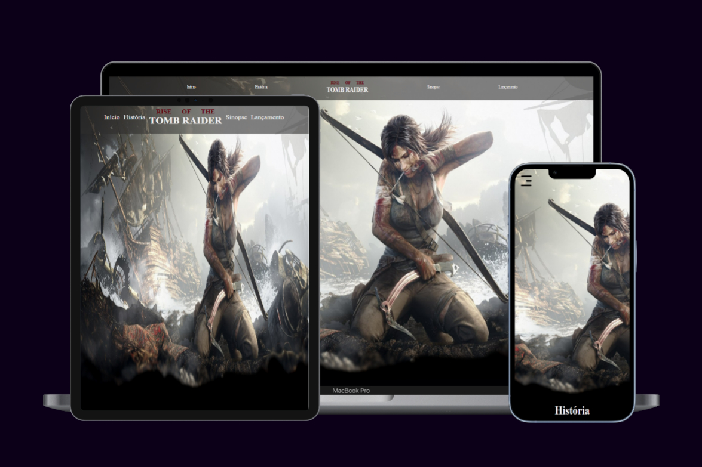

# Rise of Tomb Raider 🏹

<!---Imagem do projeto --->


> Para esse projeto eu precisei construir uma API utilizando Node.js com as informações que foram retornadas no front.


## 🚀 Instalando Rise of Tomb Raider

Para instalar o rise-of-tomb-raider, siga estas etapas:

npm install
```

### Compiles and hot-reloads for development
```
npm run serve
```

### Compiles and minifies for production
```
npm run build
```

### Lints and fixes files
```
npm run lint
```

### Customize configuration
See [Configuration Reference](https://cli.vuejs.org/config/).
"# rise-of-tomb-raider" 
